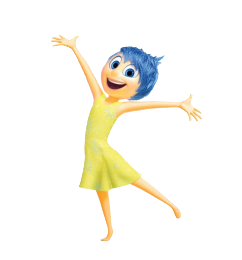
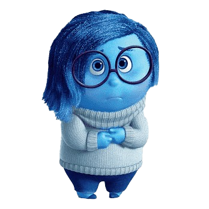
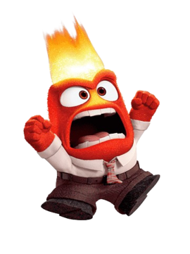
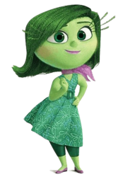

# Divertida Mente - Escolha de Personagem

## Sobre o Projeto

Este projeto é uma interface interativa baseada no filme **Divertida Mente** (Inside Out). Permite ao usuário escolher entre diferentes personagens do filme, cada um com sua própria descrição, citação e fundo temático. Desenvolvi este projeto como um exercício para aprimorar minhas habilidades em HTML, CSS e JavaScript.

## Funcionalidades

- **Navegação entre Personagens**: Use os botões de navegação para alternar entre os personagens.
- **Fundo Dinâmico**: O fundo da página muda de acordo com o personagem selecionado.
- **Citação Personalizada**: Cada personagem exibe uma citação icônica do filme.
- **Design Responsivo**: A interface é responsiva e se adapta a diferentes tamanhos de tela.

## Personagens

- **Alegria**
  - Descrição: A Alegria tenta garantir que Riley permaneça feliz.
  - Citação: "Ache algo positivo!"
  - 

- **Tristeza**
  - Descrição: A Tristeza às vezes parece atrapalhar, mas desempenha um papel crucial.
  - Citação: "Eu sou demais para ser ignorada."
  - 

- **Medo**
  - Descrição: O Medo mantém Riley segura, ajudando-a a evitar perigos.
  - Citação: "Ah! Tem certeza que isso é seguro?"
  - 

- **Raiva**
  - Descrição: A Raiva representa o sentimento de frustração e injustiça de Riley.
  - Citação: "Isso é uma injustiça!"
  - 

- **Nojo**
  - Descrição: A Nojinho garante que Riley não seja envenenada física e socialmente.
  - Citação: "Eca, que nojo!"
  - 
